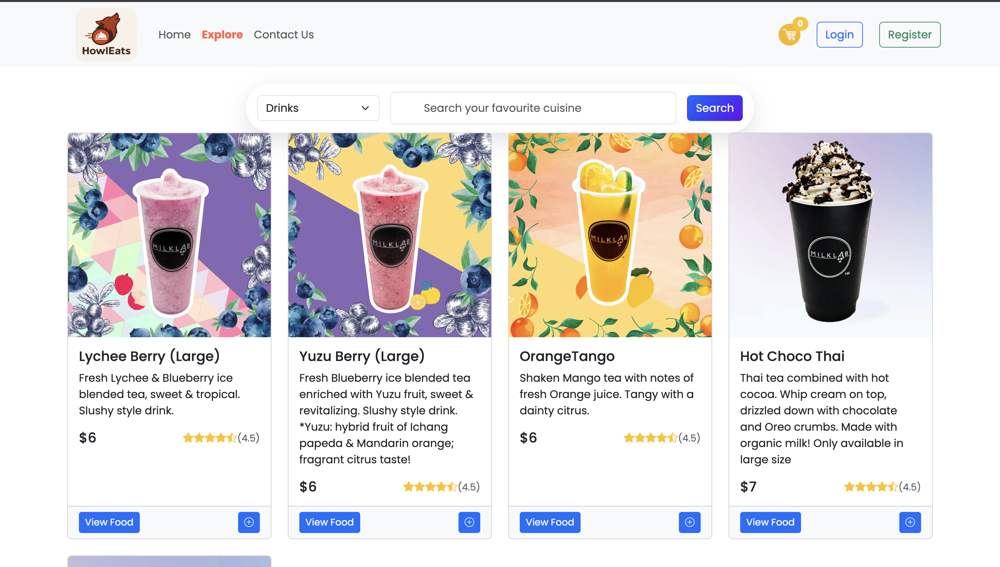
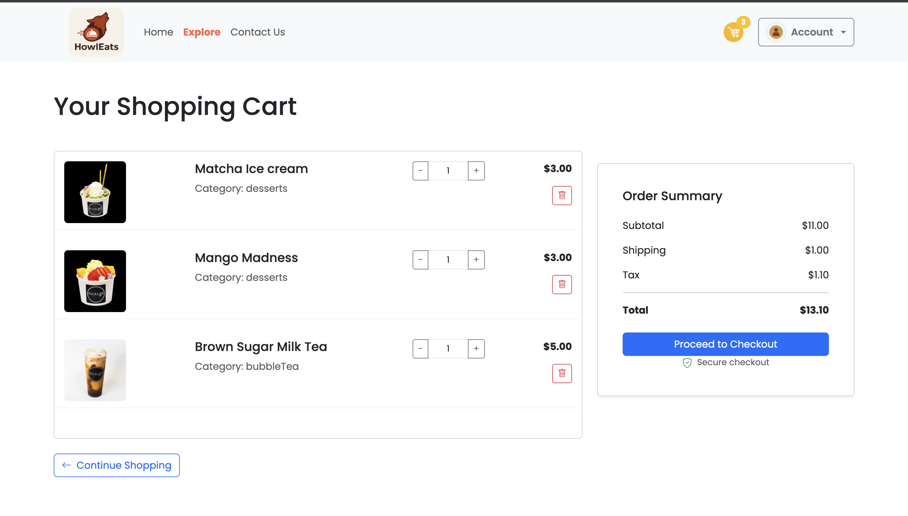
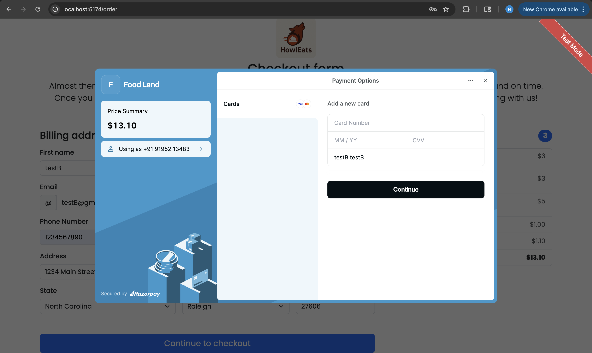
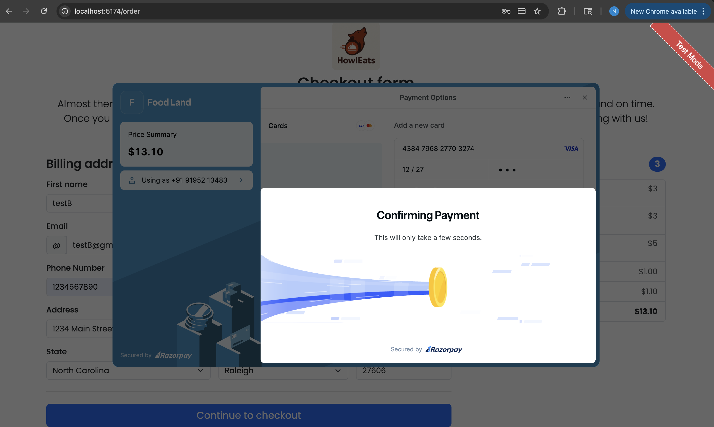
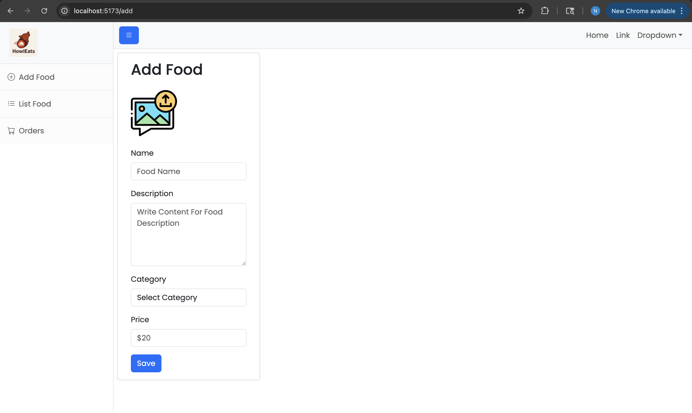
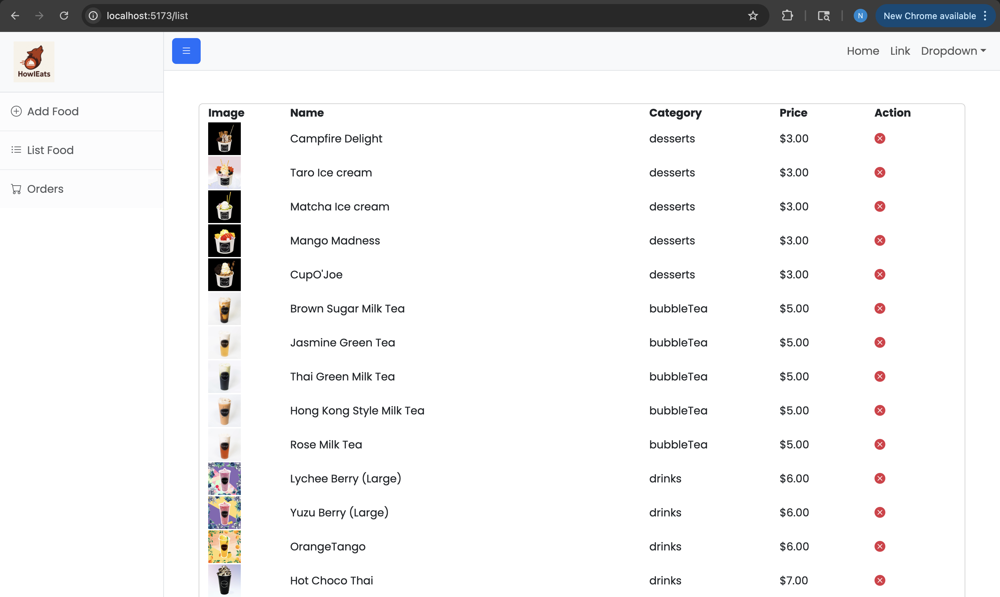
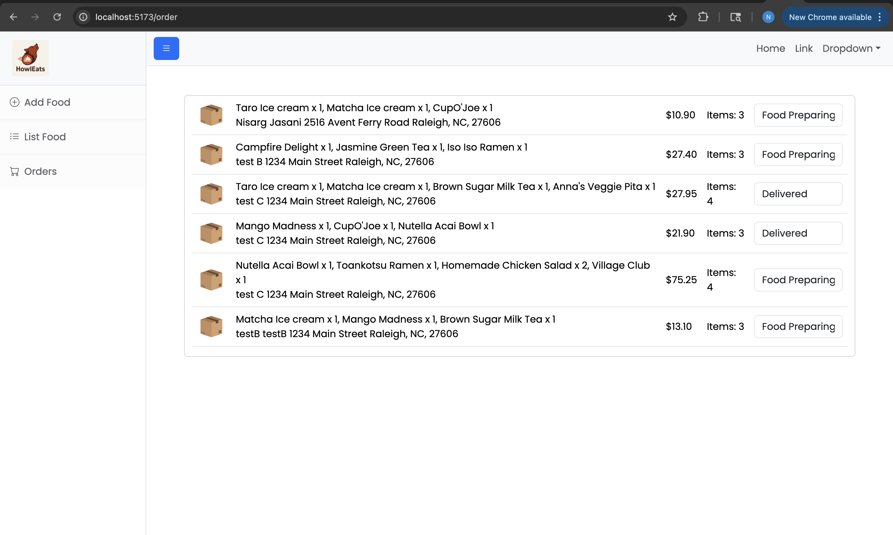

# 🍔🐺 HowlEats — Campus Food Ordering System

HowlEats is a full-stack food-ordering platform (similar to Grubhub) designed for campus dining.  
It allows **students/customers** to browse menus, add items to cart, pay securely, and track orders in real-time, while **admins** manage restaurants, menus, and order statuses.

---

## ✨ Key Features
- 🔍 Browse categories (Acai, Burrito, Sandwich, Indian, Japanese, etc.)
- 🛒 Add to cart + checkout with Razorpay integration
- 📦 Real-time order tracking (Preparing → On Route → Delivered)
- 👨‍🍳 Admin dashboard for menu and order management
- ☁️ AWS S3 integration for asset storage
- 🔐 JWT-based authentication & authorization

**Planned**
- Restaurant manager self-service onboarding
- Ratings & favorites with AI recommendations
- Order confirmation via Email/SMS
- Delivery ETA via Google Maps API

---

## 🧱 Tech Stack
- **Frontend (Customer):** React (Vite, TailwindCSS) — `howleats/`
- **Admin Panel:** React (Vite) — `adminpanel/`
- **Backend API:** Spring Boot (Java, REST API) — `HowlEatsAPI/`
- **Database:** MongoDB
- **Storage:** Amazon S3
- **Payments:** Razorpay

---

## 📂 Repository Structure

```
HowlEats/
├── howleats/                     # Customer-facing website (React + Vite)
│   ├── src/
│   │   ├── components/           # UI components (ExploreMenu, FoodDisplay, FoodItem, Header, Login, Register, etc.)
│   │   ├── context/
│   │   │   ├── StoreContext.jsx  # Global store context (auth, cart, etc.)
│   │   │   ├── UserLocationContext.js   # Provides geolocation via browser API
│   │   │   └── UserLocationContext.jsx  # Context provider wrapper for location state
│   │   ├── pages/
│   │   │   ├── Cart/             # Cart page
│   │   │   ├── Contact/          # Contact page
│   │   │   ├── ExploreFood/      # Food browsing page
│   │   │   ├── FoodDetails/      # Item detail page
│   │   │   ├── Home/             # Homepage
│   │   │   ├── MyOrders/         # Order history
│   │   │   ├── PlaceOrder/       # Checkout flow
│   │   │   └── ViewRestaurants/  # Nearby Restaurants Map Page
│   │   │       ├── ViewRestaurants.jsx  # Main map + carousel component
│   │   │       └── ViewRestaurants.css  # Styling for map and carousel
│   │   ├── service/
│   │   │   ├── authService.js
│   │   │   ├── cartService.js
│   │   │   ├── foodService.js
│   │   │   └── restaurantService.js  
│   │   ├── util/              # Helper utilities (constants, cart utils, etc.)
│   │   └── App.jsx, main.jsx, index.css
│   └── vite.config.js
│
├── adminpanel/                   # Admin dashboard
│   ├── src/
│   │   ├── components/           # Menubar, Sidebar
│   │   ├── Pages/                # AddFood, ListFood, Orders
│   │   ├── services/             # foodService.js
│   │   └── App.jsx
│   └── vite.config.js
│
├── HowlEatsAPI/                  # Spring Boot backend
│   └── src/main/java/com/nhjasani/HowlEatsAPI/
│       ├── config/               # AWS + Security config
│       ├── controller/
│       │   ├── AuthController.java
│       │   ├── CartController.java
│       │   ├── FoodController.java
│       │   ├── OrderController.java
│       │   ├── UserController.java
│       │   └── RestaurantController.java  
│       ├── entity/
│       │   ├── CartEntity.java
│       │   ├── FoodEntity.java
│       │   ├── OrderEntity.java
│       │   ├── UserEntity.java
│       │   └── RestaurantEntity.java 
│       ├── io/
│       │   ├── CartRequest.java
│       │   ├── CartResponse.java
│       │   ├── RestaurantRequest.java     
│       │   └── RestaurantResponse.java   
│       ├── repository/
│       │   └── RestaurantRepository.java  
│       ├── service/
│       │   ├── RestaurantService.java
│       │   └── RestaurantServiceImpl.java 
│       ├── util/
│       │   └── GoogleMapsClient.java
│       └── HowlEatsApiApplication.java
│
├── API_DOCS.md                    # Detailed endpoints
├── README.md                      # Project overview, setup, and usage
└── .env                           # Environment variables (AWS, Razorpay, Google API key)
```

---

## ⚙️ Setup & Installation

### 1. Clone the repository
```bash
git clone https://github.com/<your-org>/howleats.git
cd howleats
```

### 2. Environment variables
Create `.env` in the root:

```ini
# MongoDB
MONGODB_URI=mongodb://localhost:27017/howleats

# JWT
JWT_SECRET=change_me

# AWS S3
AWS_ACCESS_KEY=your_key
AWS_SECRET_KEY=your_secret
AWS_S3_BUCKET=your_bucket
AWS_S3_REGION=us-east-1

# Razorpay
RAZORPAY_KEY=rzp_test_xxxxx
RAZORPAY_SECRET=xxxxxxxxxx
```

### 3. Start backend
```bash
cd HowlEatsAPI
mvn spring-boot:run
```
Backend runs on: `http://localhost:8080`

### 4. Start customer app
```bash
cd howleats
npm install
npm run dev
```
Customer site: `http://localhost:5173`

### 5. Start admin panel
```bash
cd adminpanel
npm install
npm run dev
```
Admin panel: `http://localhost:5174`

---

## 🔐 API Overview

- Core auth routes live under `/api/login` and `/api/register` (JWT returned at login).
- Customer flows cover food browsing (`GET /api/foods`), cart management (`POST /api/cart`, `POST /api/cart/remove`), and checkout (`POST /api/orders/create`, `POST /api/orders/verify`).
- Admin-only endpoints include food creation (`POST /api/foods`) and order management (`GET /api/orders/all`, `PATCH /api/orders/status/{orderId}`).
- Fetch nearby restaurants by category `POST /api/restaurants/nearby`.
- Detailed request/response bodies, status codes, and examples are available in [`API_DOCS.md`](API_DOCS.md).

---

## 📸 Screenshots
### Home Page, Login Page & Explore Page




### Cart & Checkout (with Razorpay popup)






### Admin Dashboard





---

## 📄 Author
- Nisarg Jasani
