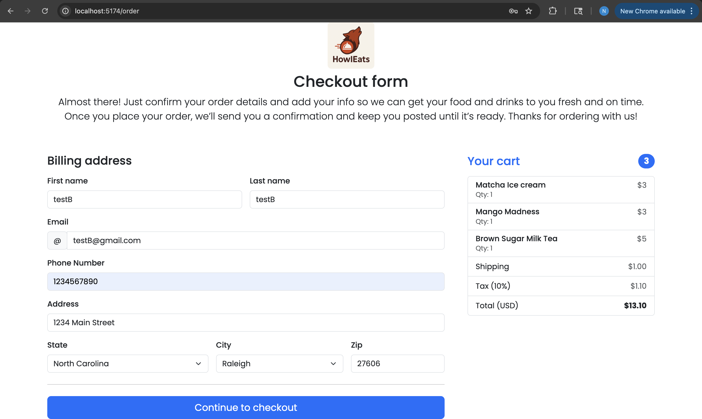

# 🍔 HowlEats — Campus Food Ordering System

HowlEats is a full-stack food-ordering platform (similar to Grubhub) designed for campus dining.  
It allows **students/customers** to browse menus, add items to cart, pay securely, and track orders in real-time, while **admins** manage restaurants, menus, and order statuses.

---

## ✨ Key Features
- 🔍 Browse categories (Acai, Burrito, Sandwich, Indian, Japanese, etc.)
- 🛒 Add to cart + checkout with Razorpay integration
- 📦 Real-time order tracking (Preparing → On Route → Delivered)
- 👨‍🍳 Admin dashboard for menu and order management
- ☁️ AWS S3 integration for asset storage
- 🔐 JWT-based authentication & authorization

**Planned**
- Restaurant manager self-service onboarding
- Ratings & favorites with AI recommendations
- Order confirmation via Email/SMS
- Delivery ETA via Google Maps API

---

## 🧱 Tech Stack
- **Frontend (Customer):** React (Vite, TailwindCSS) — `howleats/`
- **Admin Panel:** React (Vite) — `adminpanel/`
- **Backend API:** Spring Boot (Java, REST API) — `HowlEatsAPI/`
- **Database:** MongoDB
- **Storage:** Amazon S3
- **Payments:** Razorpay

---

## 📂 Repository Structure

```
HowlEats/
├── howleats/                # Customer-facing website
│   ├── src/
│   │   ├── components/      # UI components (ExploreMenu, FoodDisplay, FoodItem, Header, Login, Register, etc.)
│   │   ├── context/         # StoreContext (global state)
│   │   ├── Cart/            # Cart page & styles
│   │   ├── Contact/         # Contact page
│   │   ├── ExploreFood/     # Food browsing
│   │   ├── FoodDetails/     # Item detail page
│   │   ├── Home/            # Homepage
│   │   ├── MyOrders/        # Order history
│   │   ├── PlaceOrder/      # Checkout flow
│   │   ├── service/         # API services (authService, cartService, foodService)
│   │   └── util/            # Utils (cartUtils, constants)
│   └── vite.config.js
│
├── adminpanel/              # Admin dashboard
│   ├── src/
│   │   ├── components/      # Menubar, Sidebar
│   │   ├── Pages/           # AddFood, ListFood, Orders
│   │   ├── services/        # foodService.js
│   │   └── App.jsx
│   └── vite.config.js
│
├── HowlEatsAPI/             # Spring Boot backend API
│   └── src/main/java/com/nhjasani/HowlEatsAPI/
│       ├── config/          # AWS + Security config
│       ├── controller/      # Auth, Cart, Food, Order, User
│       ├── entity/          # Entities (Cart, Food, Order, User)
│       ├── filters/         # JWT filters
│       ├── io/              # DTOs (requests/responses)
│       ├── repository/      # Repositories
│       ├── service/         # Business logic
│       ├── util/            # JwtUtil
│       └── HowlEatsApiApplication.java
│
└── .env                     # Environment variables
```

---

## ⚙️ Setup & Installation

### 1. Clone the repository
```bash
git clone https://github.com/<your-org>/howleats.git
cd howleats
```

### 2. Environment variables
Create `.env` in the root:

```ini
# MongoDB
MONGODB_URI=mongodb://localhost:27017/howleats

# JWT
JWT_SECRET=change_me

# AWS S3
AWS_ACCESS_KEY=your_key
AWS_SECRET_KEY=your_secret
AWS_S3_BUCKET=your_bucket
AWS_S3_REGION=us-east-1

# Razorpay
RAZORPAY_KEY=rzp_test_xxxxx
RAZORPAY_SECRET=xxxxxxxxxx
```

### 3. Start backend
```bash
cd HowlEatsAPI
mvn spring-boot:run
```
Backend runs on: `http://localhost:8080`

### 4. Start customer app
```bash
cd howleats
npm install
npm run dev
```
Customer site: `http://localhost:5173`

### 5. Start admin panel
```bash
cd adminpanel
npm install
npm run dev
```
Admin panel: `http://localhost:5174`

---

## 🔐 API Overview

**Auth**
- `POST /api/auth/register` — Register
- `POST /api/auth/login` — Login, returns JWT

**Food**
- `GET /api/foods` — List items
- `POST /api/foods` — Create (admin)

**Cart**
- `GET /api/cart` — Fetch cart
- `POST /api/cart/items` — Add item

**Orders**
- `POST /api/orders/checkout` — Checkout (starts Razorpay flow)  
- `GET /api/orders` — User’s orders  
- `PUT /api/orders/{id}/status` — Update status (admin)

---

## 📸 Screenshots
### Home Page, Login Page & Explore Page


### Cart & Checkout (with razorpay popup)




### Admin dashboard


---

## 📄 Author
- Nisarg Jasani
